  
# Introduction to Amazon Virtual Private Cloud (VPC) {#section1}
Amazon **VPC**enables you to build a virtual network in the AWS cloud - no VPNs, hardware, or physical datacenters required. You can define your own network space, and control how your network and the Amazon EC2 resources inside your network are exposed to the Internet.
  
A virtual private cloud (VPC) is a virtual network dedicated to your AWS account. It is logically isolated from other virtual networks in the AWS Cloud. You can specify an IP address range for the VPC, add subnets, add gateways, and associate security groups.
  
## Getting started with Amazon VPC
  
Follow the steps below to get started with the lab.
  
1.Sign in to the AWS Management Console by copying the  **Sign-in link**, **Username**, and **Password** provided below.
Or just click [AWS Console](https://aws.amazon.com/console/ )
  
    - Sign-in Link: https://aws.amazon.com/console/
    - IAM Username:
    - Password:

  
2.You will see a ***AWS_Console***
  
.png)
  
3.Go to ***Search bar*** and search for the service ***VPC*** and press **Enter**
  

  
4.After selecting **VPC** you will see ***VPC dashboard***  , now in top right corner select the **region** you want your VPC to be created
  

  
5.Now click on ***Create VPC*** button on the screen
  

  
6.You can also create ***VPC*** by selecting the **Your VPC** on left panel
  
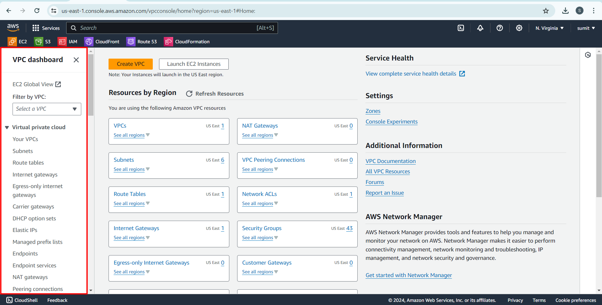
  
7.Once you start the VPC creation you will see a [**default VPC**](#section5 ) present in that window.
Click to know more about [default VPC](https://docs.aws.amazon.com/vpc/latest/userguide/default-vpc.html )
  
  
And on top right corner select the **create VPC** button to create it manually (will be doing the same in some time)
  

  
Now click on default **VPC Id** present on screen to explore more about that VPC
  
After clicking you will see the screen as shown below
  

Here you can see the details of Default VPC
  
Next Scroll down you will see a ***resource map***

That Resource map conatins
- [VPC](#section1 )
- [Subnets](#section2 )
- [Route Tables](#section3 ) &
- [Connection networks](#section4 ) 
  
----
#### Creating VPC
Now Go back to **your VPC** window to create the **VPC** of your own. Click on ***create VPC***

  
Creation of VPC done in *Two ways* 
- ***VPC only***  &
- ***VPC and more***
  
##### VPC Only
  
select **VPC only** 
Follow the steps as shown below

  
And *CIDR* to know more about it click on the link given below
[CIDR](https://docs.aws.amazon.com/vpc/latest/userguide/vpc-cidr-blocks.html )
create the vpc as shown in the picture
  
Once the creation done properly you will see the vpc created successfully

  
*Successfully created VPC using VPC Only*
  
Now again back to **VPC dashboard** and *your VPC* you will see the vpc created by you.
  
But above process doesn't give you a complete VPC ie *VPC* with subnets,Route table and internet gateway.
Here subnets,Route table and internet gateway must be created manually
  
#### Creating SUBNET
  
Now select **Subnets** from left panel and clik ***create subnet*** present on top right

Now Follow the steps as shown below

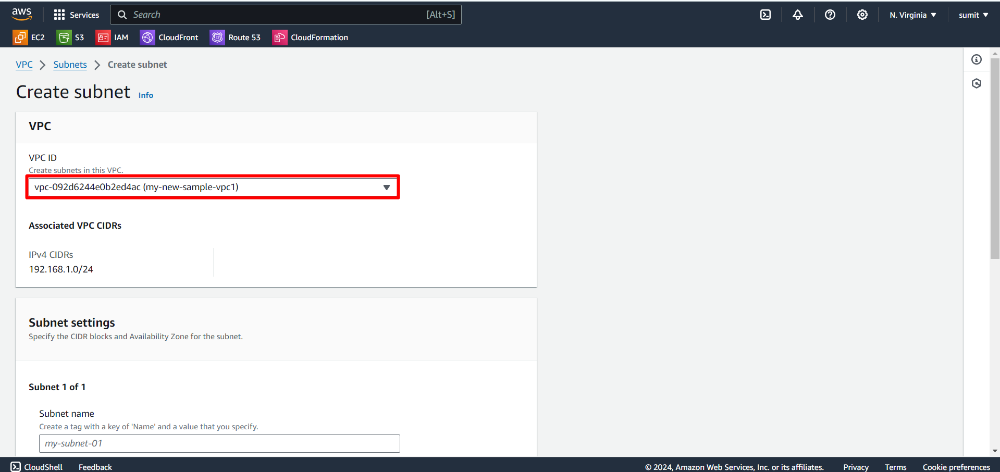
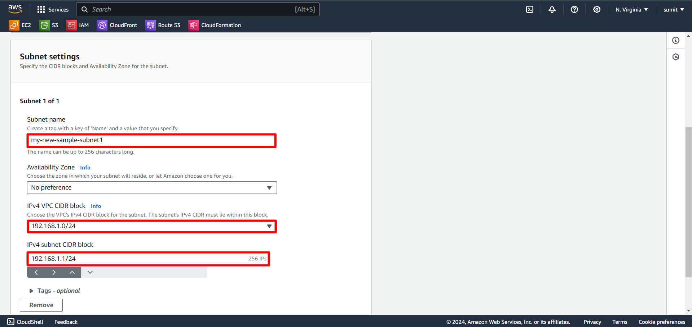

  
Now back to dashboard to see the subnet that is created

  
---
#### Creating Route Tables
Now select **Route Tables** from left panel and clik ***create Route Table*** present on top right
Now Follow the steps as shown below

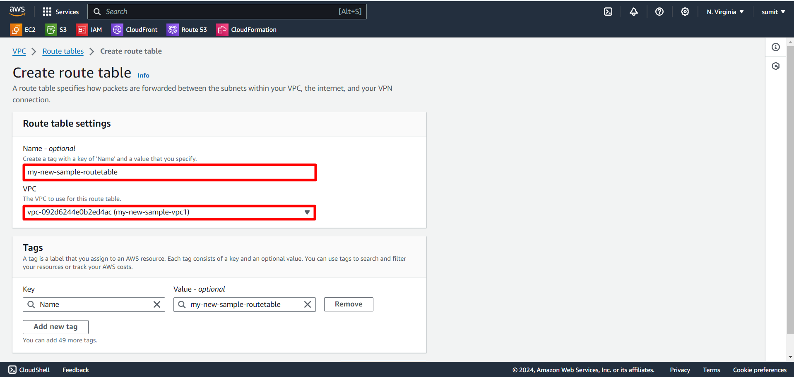

  
You will see the Route table in dashboard
  
---
#### Creating Internet Gateway
Now select **Internet Gateway** from left panel and clik ***create Internet Gateway*** present on top right
Now Follow the steps as shown below
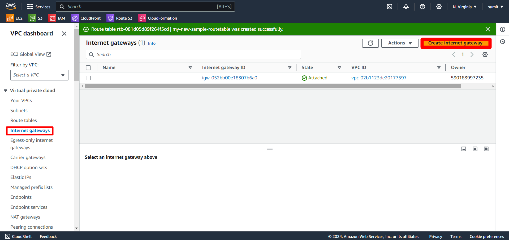
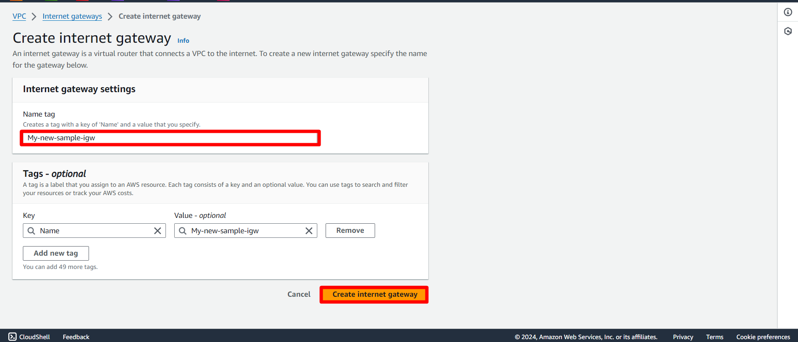
  
Once the creation is done attach *internet gateway* to VPC that you have created
Now Follow the steps as shown below
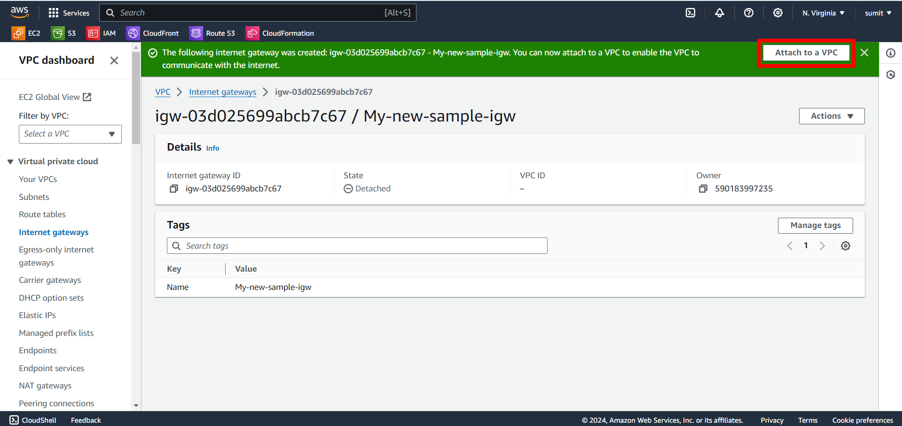

  
---
##### Edit Routes
Now back to **Route Table** and select **Routes** and perfom the action as shown

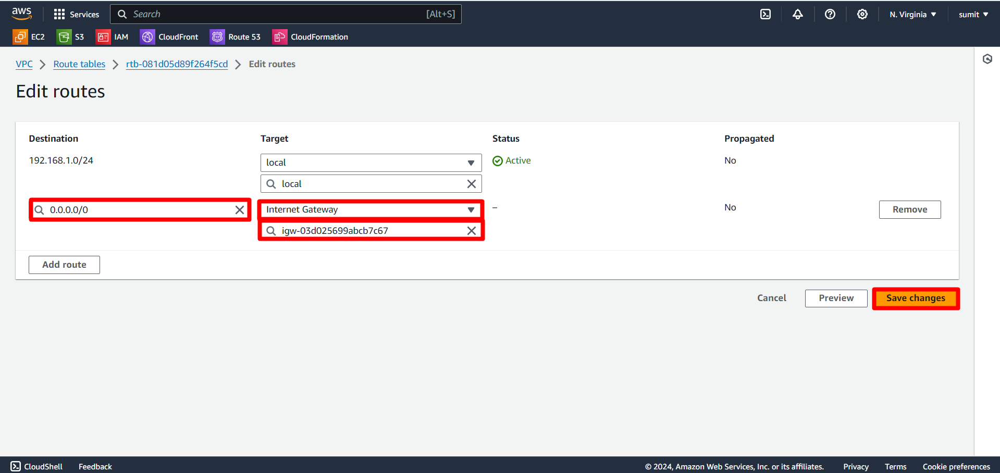 
Click on *Save changes*

##### Subnet Association
And in that window itself select **Subnet Association** and perform the action as shown

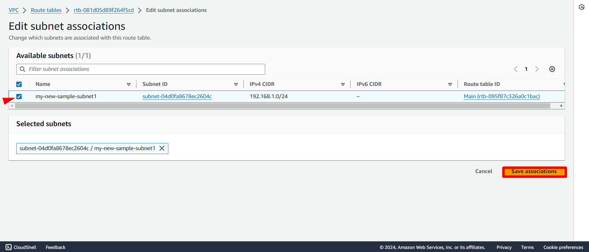
Click on *Save Association*
  
---
Now Again back to **your VPC** and select the VPC that you have created and panel that appears at bottom shows the ***Resource Map***

  
You have Successfully created the complete **VPC** with subnets,Route Table and Internet gateway which were not present before.
  
  
---
##### VPC and more
  
Now Go back to **your VPC** window to create the **VPC** of your own. Click on ***create VPC***

  
This time select *VPC and more*
  
Follow the steps shown below to perform the same
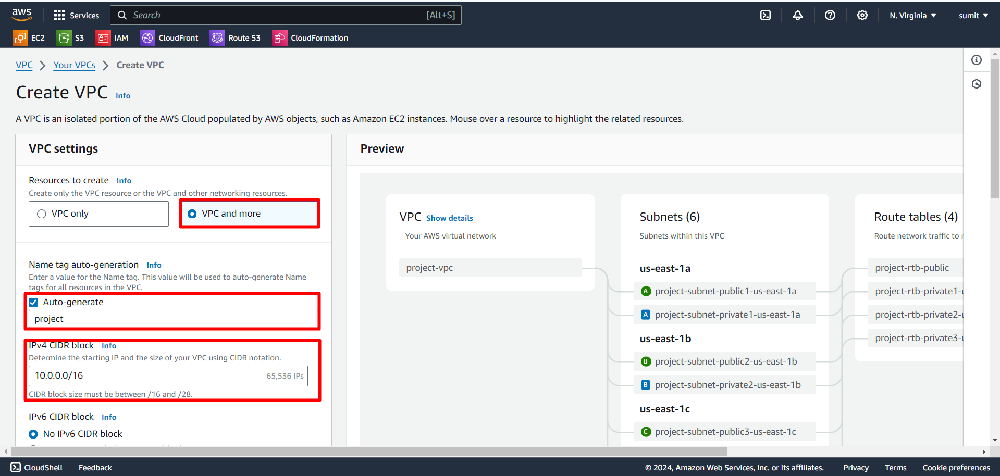

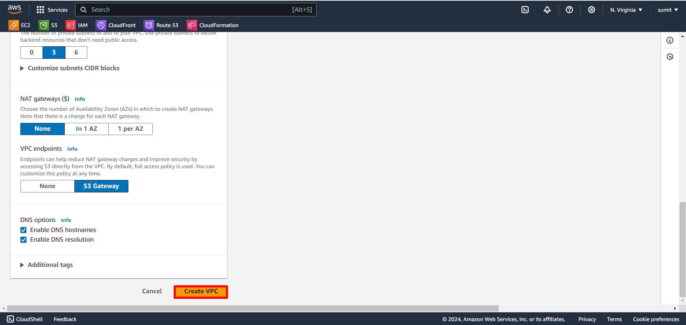
  
A **preview** that shows the flow and connections
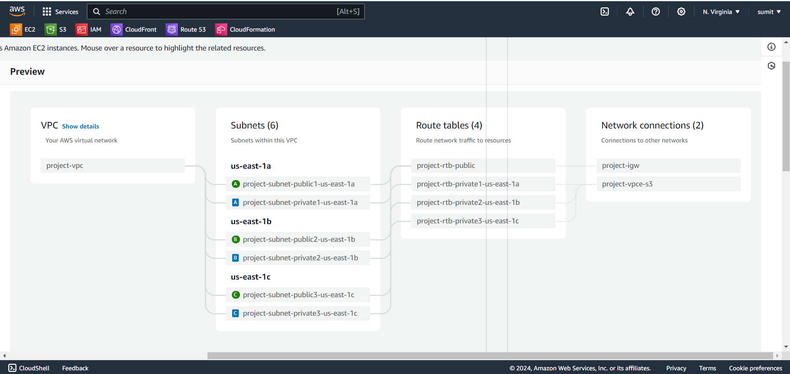
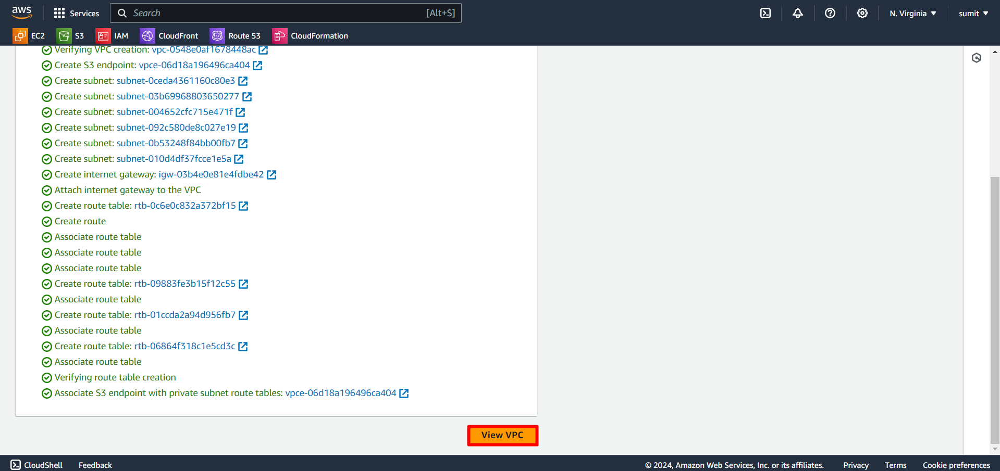
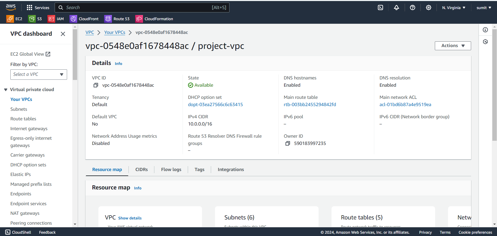
  
Once you complete the process and clicks *create VPC* & then *View VPC* a window will be opened stating the successfully creation of ***VPC***
  
Successfully created the ***VPC***.
  
#### What is Default VPC? {#section5}
A default VPC comes with a public subnet in each Availability Zone, an internet gateway, and settings to enable DNS resolution. Therefore, you can immediately start launching Amazon EC2 instances into a default VPC. You can also use services such as Elastic Load Balancing, Amazon RDS, and Amazon EMR in your default VPC.
A default VPC is suitable for getting started quickly and for launching public instances such as a blog or simple website. You can modify the components of your default VPC as needed.
  
---
  
##### SUBNET{#section2}
A subnet is a range of IP addresses in your VPC. You can create AWS resources, such as EC2 instances, in specific subnets.
###### Subnet types
The subnet type is determined by how you configure routing for your subnets. For example:
  
**Public subnet** – A subnet that can access the Internet is a public subnet. It is the subnet that has a route table entry that points to an internet gateway. Resources that are required to face or receive Internet traffic can be added to a public subnet
  
**Private subnet** – A subnet that cannot access the Internet is a private subnet. It is the subnet that does not have a route table entry that points to an internet gateway. Resources that are not required to be publicly available are within a private subnet.
  
To Know more Click [Subnets](https://docs.aws.amazon.com/vpc/latest/userguide/configure-subnets.html )
  
----
  
##### Route Tables{#section3}
Route tables are essentially a set of rules. These rules help us determine where to direct the network traffic from a subnet or gateway. We can assign a specific route table to a subnet.
  
To Know more Click [Route Tables](https://docs.aws.amazon.com/vpc/latest/userguide/VPC_Route_Tables.html )
  
  
---
  
##### Connection networks{#section4}
  
A gateway essentially connects a VPC to another network. For instance, if we want to connect a VPC to the internet then we will use an Internet Gateway. The default VPC includes an internet gateway by default.
The default VPC has a public subnet in each availability zone along with an internet gateway.
  
To Know more Click [Internet Gateway](https://docs.aws.amazon.com/vpc/latest/userguide/VPC_Internet_Gateway.html )
  
  